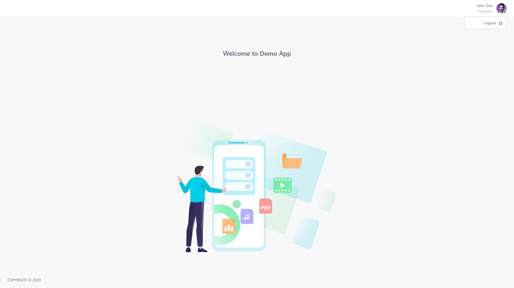

# **Entrance Test Submission (React)**
This is my entrance test submission for the ReactJS Entrance Test.
## .ENV file
Create an** .env** file following the contents in **.env.example**
```
REACT_APP_API_URL_SIGNIN=your-signin-api-url
REACT_APP_API_URL_SIGNUP=your-signup-api-url
REACT_APP_API_URL_SIGNOUT=your-signout-api-url
```
## UI of the application
- Login page

- Sign Up Page

- DashBoard Page
